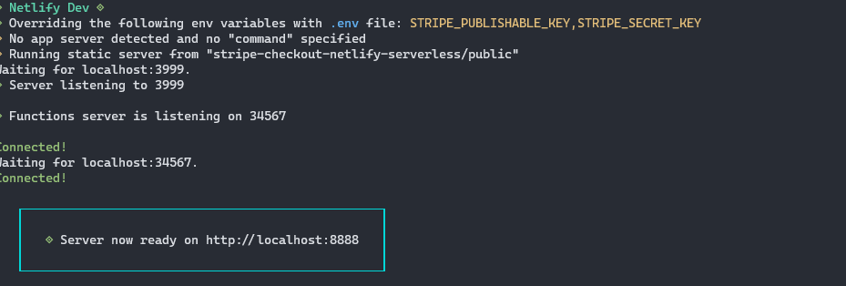

# ABOUT

> Following the tutorial [here](https://egghead.io/lessons/javascript-return-json-data-from-a-serverless-function-using-netlify-functions?pl=sell-products-using-stripe-checkout-and-netlify-functions-25f6).


## What I Learned

1. I didn't know you could do this.

```html
<script type="module">
    import { loadProducts } from "./js/load-products.js";
    loadProducts();
</script>
```

2. If you have an `.env` file then `netlify dev` ignores the environment variables that you have in production.




3. You can configure `git` to go to the github page for your repo.

> $ git browse ##  You have to set things in your git config though.  I have yet to do this.

4. Html `<Templates/>` and `document.querySelector()`.

> I always used `getElementById()` or one of the other ones.  I had no idea about <Template/>.

## ENDPOINTS

1. `/.netlify/functions/get-products.js`

